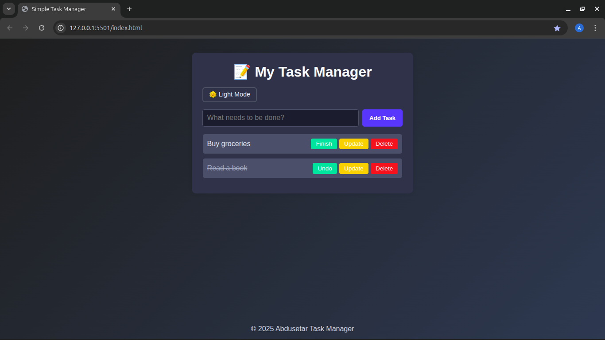

<<<<<<< HEAD
# 🌟 Simple Task Manager - Internship Challenge

This is a simple and responsive Frontend Task Manager built using HTML, CSS, and JavaScript.
=======
Simple Task Manager - Internship Challenge

This is a simple Frontend Task Manager built using HTML, CSS, and JavaScript as part of the internship screening challenge on Kuraztech.
>>>>>>> e79f4e6b13d32f3cdf907dbccf4cda196afcb390

## 🔧 Features

- ✅ View a list of tasks
<<<<<<< HEAD
- ➕ Add new tasks
- ✔️ Mark tasks as completed
- ❌ Delete tasks
- 🌙 Toggle dark mode
- 📱 Fully responsive and centered on all screen sizes
- 🎨 Clean and modern UI with background image
=======
- ➕ Add a new task
- ✔️ Mark a task as completed
- ❌ Delete a task
- 🎨 Stylish UI with background image and smooth layout
>>>>>>> e79f4e6b13d32f3cdf907dbccf4cda196afcb390

## 📸 Screenshot

## 📁 Project Structure

<<<<<<< HEAD
frontend/ ├── index.html ├── style.css └── script.js
=======
/frontend/ ├── index.html ├── style.css └── script.js
>>>>>>> e79f4e6b13d32f3cdf907dbccf4cda196afcb390

## 🚀 How to Run

1. Clone or download this repository.
<<<<<<< HEAD
2. Open index.html in any modern browser.
3. Start managing your tasks — now with dark mode and responsive design!

> 💡 Note: This version uses a hardcoded tasks array only (no backend).

## 🎯 Bonus Features

- ✅ Validation (prevents adding empty tasks)
- 🌑 Dark mode toggle (added)
- 📱 Responsive layout for phone and tablet
- 🚫 Filtering (e.g., completed vs. pending) — _Not included_
=======
2. Open index.html in any browser.
3. Start managing your tasks!

> 💡 Note: This project uses a hardcoded array (no backend).

## 💡 Bonus Features (Optional)

- Filtering (Completed vs. Pending) — _Not included in base version_
- Validation (Prevents adding empty tasks) — ✅ Included
>>>>>>> e79f4e6b13d32f3cdf907dbccf4cda196afcb390

## 📚 Technologies Used

- HTML5
- CSS3
- JavaScript (Vanilla)
<<<<<<< HEAD

## 📄 License

This project is for educational and internship evaluation purposes only.
=======
- Optional: Tailwind/Bootstrap (not used in this version)

## 📄 License

This project is for educational and internship evaluation purposes.
>>>>>>> e79f4e6b13d32f3cdf907dbccf4cda196afcb390
